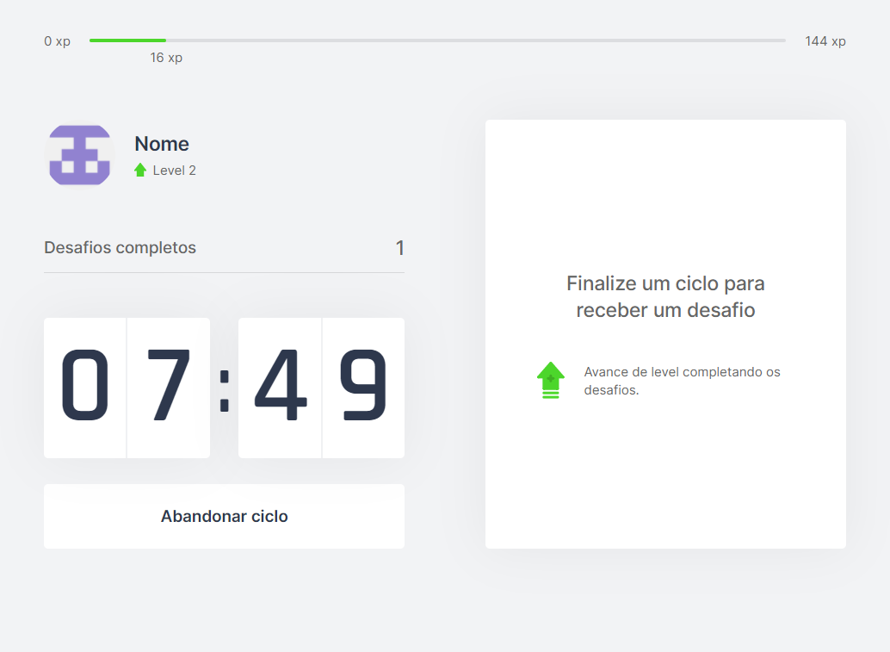
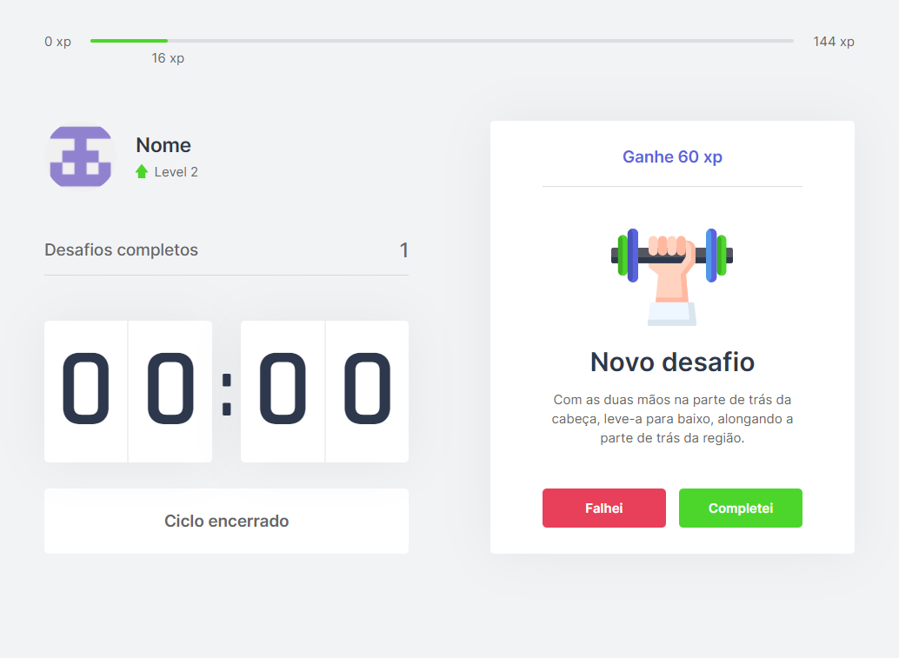

---




[Acessar aplicação WEB](https://moveit-luanws.vercel.app/)


## 🚀 Tecnologias utilizadas
- [Next.js](https://nextjs.org/)
- [React.js](https://reactjs.org/)
- [Typescript](https://www.typescriptlang.org/)

##  Começando

Para obter uma cópia local instalada e funcionando, siga estas etapas seguintes.

### Pré-requisitos

- [node](https://nodejs.org/)
- [npm](https://www.npmjs.com/get-npm)

### Instalação

1. Clone o repositório
```sh
git clone https://github.com/luanws/moveit.git
```

2. Acesse a pasta do projeto
```sh
cd moveit
```

3. Instale as dependências
```sh
npm install
```

### Execução o projeto

Primeiro, inicie o servidor de desenvolvimento:

```bash
npm run dev
```

Abra [http://localhost:3000](http://localhost:3000) com seu navegador para ver o resultado.